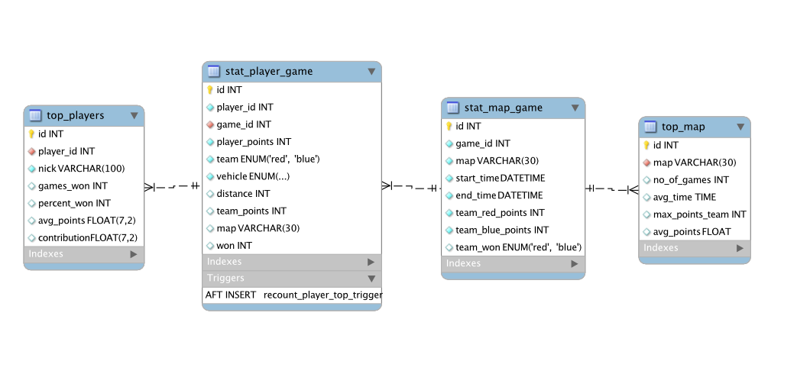

# Dokumentacja - Statystyki

Aby uruchomić wyśwtelanie statystyk na stronie:
----------

    uruchomienie strony wg instrukcji (w tym `python3 manage.py migrate`) 
    uruchomienie skryptu baza_staty.sql w wybranej bazie MySQL (w pierwszych linkjkach trzeba zmienic wybraną bazę)
    standardowe uruchomienie za pomocą `python3 manage.py runsslserver [port]`

Obsługa API:
--------

API posiada własny link `[strona]/api/[zapytanie]`, wszystko jest zwracane w formacie JSON

Dostępne zapytania:
- `test` - zwraca czy API działa
- `top_players_all` - zwraca całą tabelę `top_players` z przetworzonymi danymi
- `top_maps` - zwraca statystyki map
- `player/[player]` - zwraca wszystskie gry danego gracza

### format danych
`test`:

    {
        "works?": "yes"
    }

`top_players_all`:

    [
        {
            "player_id": [int], "Nick": [str], "games_won": [int], 
            "percent_won": [int], "avg_points": [double], 
            "contribution": [double]
        }, 
        ...
    ]

`top_maps`:

    [
        {
            "map": [str], "no_of_games": [int], 
            "max_points_team": [int], "avg_points": [double
        }, 
        ...
    ]

`player/[player]`:

    [
        {
            "nick": [str=player], "player_id": [int], "game_id": [int], 
            "player_points": [int], "team": [str], "vehicle": [str], "distance": [int], 
            "team_points": [int], "map": [str], "won": [int]
        }, 
        ...
    ]

Baza danych
------------

Tabele:

Tabele `top_players` oraz `top_map` są automatycznie uzupełniane za pomocą procedur `recount_player_top` oraz `populate_top_map`, które są odpowiednio uzupełniane po każdym `insert` na `stat_player_game` oraz co godzinę w przypadku `stat_map_game`. Dokładne procedury znajdują się w pliku [baza_staty.sql](./docs_files/baza_staty.sql).

Populacja bazy danych
---------

Dane w bazie danych są uzupełniane przez _Backend-Podproces_ po każdej zakończonej grze - jeden `insert` do `stat_map_game`, oraz dla każdego gracza do `stat_player_game`

Struktura funkcji, plików oraz routing `Django` - strona
--------

Bazowe przekierowanie w [webiste/urls.py](../website/website/urls.py) jest takie samo jak dla reszty strony, tj. przekierowuje do [core/urls.py](../website/core/urls.py). Tam już znajdują się finalne przekierowania do [core/views.py](../website/core/views.py). W [views.py](../website/core/views.py) następuje pobranie danych z bazy za pośrednictwem modułu [core/databaseInteraction.py](../website/core/databaseInteraction.py) (oraz w przypadku wyszykiwania danego gracza w `statistics` za pomocą formularza `NameForm` znajdującego się w [core/forms.py](../website/core/forms.py)), skąd następuje zwrócenie pliku (o nazwie identyczniej jak funkcja) `html` wraz z danymi z bazy znajdujących się w folderze `templates`, przykładowo [templates/statistics.html](../website/templates/statistics.html).

Struktura funkcji, plików oraz routing `Django` - API
--------

Bazowe przekierowanie w [webiste/urls.py](../website/website/urls.py) przekierowuje do pliku [core/urls_api.py](../website/core/urls_api.py), który przekierowuje do odpowiednich funkcji w [core/views.py](../website/core/views.py). Funkcje te (z powodu dziwnych błędów w innym przypadku) bezpośrednio pobierają dane z bazy danych oraz po przerobieniu na format `JSON` zwracają odpowiednie dane.